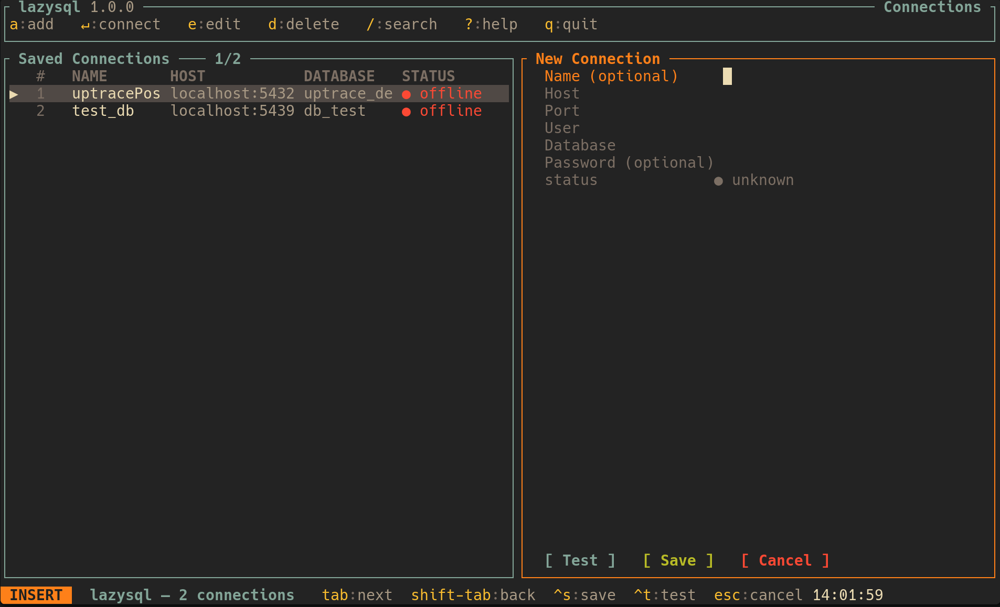

# LazySql

Ленивый TUI-клиент для работы с базами данных — вдохновлён lazygit.



## Установка

Либо через git репозиторий, либо через flake.nix, в планах добавить ещё для guix

Добавляете в inputs

```nix
    inputs.lazysql.url = "git+https://codeberg.org/yorunikakeru/lazysql.git";
```

После через specialArgs добавляете в

```nix
 environment.systemPackages = [
    inputs.lazysql.packages.${pkgs.stdenv.hostPlatform.system}.lazysql
  ];

```

## Что уже работает

- Подключение к PostgreSQL/Mysql с сохранением конфигов в `~/.config/lazysql/config.toml`
- Список подключений с индикаторами онлайн/офлайн статуса и поиском
- Система тем, в .config/lazysql/themes/ инициализируется набор тем, а так же в theme.toml можно выбрать/описать тему
- Браузер схем и таблиц
- Inspect-экран: поля, типы, индексы, FK-ссылки, размер таблицы
- Просмотр записей с постраничной навигацией
- SQL-редактор с подсветкой синтаксиса (sqlparser) и выполнением запросов
- Vim-стиль управление: Normal / Insert / Search / Command / Result

## В планах

- Поддержка ClickHouse, Oracle
- Редактирование и удаление записей прямо из TUI
- Интеграция в nvim/vim (плагин) (наверное)

## Стек

| Crate            | Роль                                 |
| ---------------- | ------------------------------------ |
| `ratatui`        | TUI-рендеринг                        |
| `crossterm`      | терминальный бекенд                  |
| `tokio`          | async runtime                        |
| `tokio-postgres` | драйвер PostgreSQL                   |
| `sqlparser`      | подсветка синтаксиса в SQL-редакторе |
| `serde` + `toml` | хранение конфигов на диске           |
| `mysql_async`    | драйвер MySQL                        |

## Быстрый старт

### С `just` (рекомендуется)

```bash
just dev      # собрать и запустить
just test     # поднять тестовый PostgreSQL, прогнать тесты, снести контейнер
just up       # поднять тестовую БД в фоне (без запуска тестов)
just down     # остановить и удалить тестовую БД
just connect  # подключиться к тестовой БД через pgcli
just build    # release-сборка
```

### Без `just`

**Запуск:**

```bash
cargo run --release
```

**Unit-тесты** (без базы данных):

```bash
cargo test
```

**Интеграционные тесты** (требуют запущенного PostgreSQL):

```bash
# 1. Поднять тестовую БД
podman-compose up --build -d
until podman exec postgres_test pg_isready -U test; do sleep 1; done

# 2. Запустить тесты с паролем из контейнера
TEST_DB_PASSWORD=$(podman exec postgres_test printenv POSTGRES_PASSWORD) cargo test -v

# 3. Убрать контейнер
podman-compose down -v
```

Тестовая БД: `localhost:5439`, пользователь `test_user`, база `db_test`.

Конфиг хранится в `~/.config/lazysql/config.toml` и редактируется прямо из TUI.

---

> Первый не-hello-world проект на Rust. Код открытый — используйте как хотите. (MIT)
